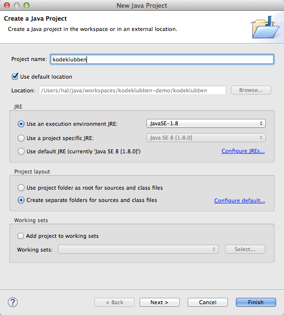
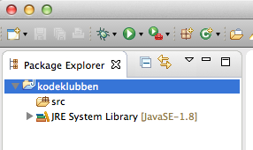
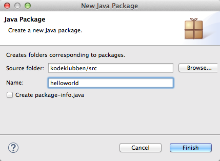
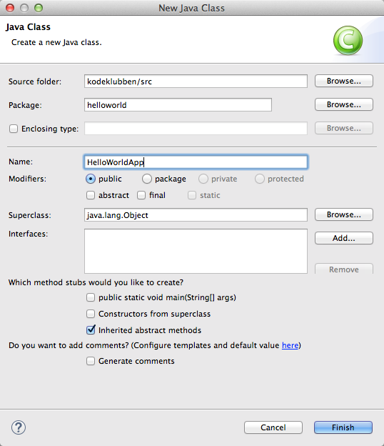

# Introduksjon {.intro}

Formålet til denne leksjonen er å lære hvordan man får satt opp et Java-prosjekt i Eclipse og kjørt et JavaFX-program. I tillegg skal du lære litt om sammenhengen mellom JavaFX-koden og innholdet i app-vindeuet en får opp.

# Steg 1: Sette opp Java-prosjekt, og lage app-mappe og app-klasse {.activity}

Eclipse strukturerer koden i såkalt prosjekter. Vanligvis har en ett Java-prosjekt for hver app en lager, men hvis en for det meste lager små app-er, så er det greit å samle dem i ett Java-prosjekt. Da blir det mindre arbeid med oppsett.

Et prosjekt er enkelt sagt en mappe med innhold/oppsett tilpasset typen app en skal lage. Først og fremst handler det om å velge programmeringsspråk, så når du skal lage en ny app med JavaFX, så må du lage et _Java-prosjekt_. Du vil da få en mappe med flere under-mapper, og en av disse heter `src` og vil inneholde all koden din. For at de ikke skal bli for uoversiktlig, spesielt hvis du har flere app-er i samme prosjekt, så bør du så lage en Java-mappe for app-en din. Når det er gjort så kan lage Java-filen for app-en din!

## Sjekkliste {.check}

+ Lag et nytt Java-prosjekt ved å velge `File > New > Java Project` (altså `New > Java Project` fra `File`-menyen). Du vil da få opp et skjema hvor du bl.a. kan fylle inn navnet på prosjektet. Skriv `kodeklubben` eller et annet passende navn. Merk at du bør holde deg til de engelske bokstavene a-z og A-Z, ellers får du lett problemer siden. De andre innstillingene lar du være.

	

	I `Package Explorer`-panelet vil du se at det dukker opp en mappe med navnet du valgte. Inne mappa vil du ha en `src`-mappe og en mappe som heter `JRE System Library [JavaSE-1.8]`. `src`-mappe er der du legger koden din, mens `JRE System Library [JavaSE-1.8]` viser at prosjektet er satt for å bruke Java 8, som vi trenger for å bruke JavaFX.

	
	
+ Lag en ny Java-_mappe_ for app-en i denne leksjonen. I Java kalles slike mapper for _pakker_, men du kan tenke på dem som mapper. Pass først på at du har valgt (klikket på) riktig Java-prosjekt i `Package Exporer`-panelet. Velg så  `File > New > Package` eller ikonet som ser ut som en pakke med et pluss-tegn i hjørnet. Alternativt kan du høyre-klikke på src-mappa og velge `New > Package`.

	Du vil da få opp et skjema hvor du kan skrive inn hvilken kode-mappe (`Source Folder`) som pakken skal puttes i og pakke-navnet. Kode-mappen skal være `kodeklubben/src` (eller prosjektnavnet du skrev inn tidligere etterfulgt av `/src`. Pakkenavn inneholder som regel bare små bokstaver, altså bokstaven a-z. Derfor kan du kalle mappa `helloworld`.

	
	

+ Lag en ny Java-klasse (Java-filer kalles _klasser_) ved å høyre-klikke på `helloworld`-pakka du nettopp lagde og velge `New > Class`.

	

	Du vil da få opp et skjema hvor kode-mappa og pakken allerede er fylt inn, mens navnet (`Name`) må fylles inn. Klassenavn starter alltid med stor forbokstav, og hvert delord som navnet består av, begynner også med stor forbokstav. Så når vi nå skal lage en app vi kaller Hello World-app, så blir navnet klassenavnet `HelloWorldApp`.

	
	

# Steg 2: Skrive og kjøre HelloWorldApp-klassen {.activity}
